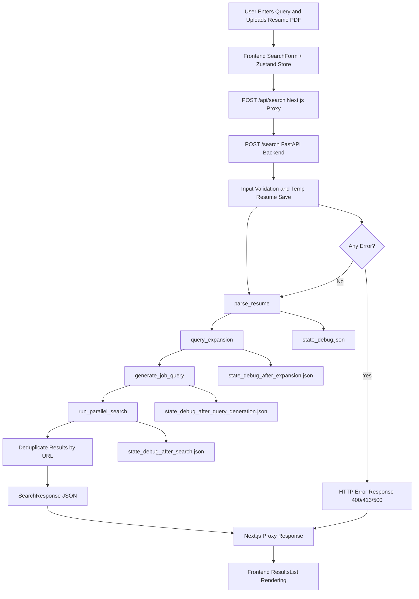

# Agentic JSO

Intent-aware Job Search Optimizer prototype with:

- FastAPI backend for resume parsing, query expansion, xray query generation, and parallel search.
- Next.js frontend with a clean input workflow and result cards.
- Proxy-based frontend API routes for simple integration and safer browser/backend boundaries.

## 1. What This Project Does

This project accepts:

- a user query (for example: "Staff ML roles in fintech")
- a resume PDF
- optional search intent terms (for example: remote, startup, full-time)
- optional location preferences

It runs a backend pipeline that:

1. Parses resume content into structured data.
2. Expands the query with intent-aware role/skill/domain signals.
3. Generates source-specific xray queries.
4. Executes parallel web search calls and returns deduplicated opportunities.

## 2. Current Architecture

### Backend

- Framework: FastAPI
- Entry point: `backend/main.py`
- Main API endpoints:
	- `GET /health`
	- `POST /search`

Pipeline node order in `POST /search`:

1. `backend/nodes/parser.py` -> `parse_resume`
2. `backend/nodes/query_expansion.py` -> `query_expansion`
3. `backend/nodes/query_generator.py` -> `generate_job_query`
4. `backend/nodes/search.py` -> `run_parallel_search`

### Frontend

- Framework: Next.js 14 + React + TypeScript + Zustand
- UI route: `frontend/app/page.tsx`
- Proxy API routes:
	- `frontend/app/api/health/route.ts`
	- `frontend/app/api/search/route.ts`

The browser sends requests to Next.js API routes. Those routes forward to backend endpoints configured via environment variable.

## 3. Repository Structure

```text
backend/
	main.py
	nodes/
		parser.py
		query_expansion.py
		query_generator.py
		search.py
	utils/
		config.py
		prompts.py
		schema.py

frontend/
	app/
		page.tsx
		api/
			health/route.ts
			search/route.ts
	components/
	store/
	lib/backend.ts
	types/
```

## 4. Data Contracts

### 4.1 Request: `POST /search`

Content-Type: `multipart/form-data`

Required fields:

- `query`: string (non-empty)
- `resume`: file (PDF only, max 20 MB)

Optional repeated fields:

- `job_search_intent`: string
- `location_preferences`: string

The backend normalizes optional term lists by trimming, splitting comma-separated values, and removing case-insensitive duplicates.

### 4.2 Success Response

```json
{
	"search_results": [
		{
			"title": "...",
			"snippet": "...",
			"link": "...",
			"url": "..."
		}
	]
}
```

Notes:

- Result objects are passthrough-normalized search provider items.
- `url` is canonicalized from `link` when needed.

### 4.3 Error Responses

Common response patterns:

- `400` invalid input (empty query, bad filename/format, parse/validation issues)
- `413` resume exceeds 20 MB
- `500` unexpected pipeline failures
- Frontend proxy `504` when search timeout is hit (75 seconds)
- Frontend proxy `502` when backend is unreachable

## 5. Environment Variables

### Backend required

- `GEMINI_KEY`
- `SERP_DEV_API_KEY`

Runtime compatibility behavior:

- If `GEMINI_KEY` exists, backend sets `GOOGLE_API_KEY` and `GEMINI_API_KEY` automatically for provider compatibility.

### Frontend

- `NEXT_PUBLIC_BACKEND_URL` (default fallback: `http://127.0.0.1:8000`)

## 6. Local Development Setup

### 6.1 Prerequisites

- Python 3.11+
- Node.js 18+
- npm

### 6.2 Backend setup

From repository root:

```powershell
python -m venv .venv
.\.venv\Scripts\Activate.ps1
python -m pip install --upgrade pip
pip install -e .
```

Create a `.env` file in repository root:

```env
GEMINI_KEY=your_gemini_key
SERP_DEV_API_KEY=your_serper_key
```

Install required NLP assets for resume parsing:

```powershell
python -m nltk.downloader stopwords punkt
python -m spacy download en_core_web_sm
```

Run backend:

```powershell
uvicorn backend.main:app --reload
```

Backend API base URL:

- `http://127.0.0.1:8000`

### 6.3 Frontend setup

From `frontend`:

```powershell
npm install
```

Create `frontend/.env.local`:

```env
NEXT_PUBLIC_BACKEND_URL=http://127.0.0.1:8000
```

Run frontend:

```powershell
npm run dev
```

Frontend URL:

- `http://localhost:3000`

## 7. End-to-End Flow

1. User fills query, uploads PDF, and optionally adds intent/location chips in frontend.
2. Frontend store (`zustand`) builds `FormData` and sends `POST /api/search`.
3. Next.js proxy route forwards multipart payload to backend `POST /search`.
4. Backend validates and stores uploaded PDF temporarily.
5. Pipeline nodes run in order.
6. Search results are deduplicated by URL and returned.
7. Temp file is deleted in a `finally` block.
8. UI renders result cards and last-run timestamp.

### 7.1 Workflow Diagram



## 8. API Quick Checks

Health check:

```powershell
Invoke-RestMethod -Method Get -Uri "http://127.0.0.1:8000/health"
```

Search request (PowerShell multipart):

```powershell
$form = @{
	query = "Staff backend engineer fintech"
	resume = Get-Item ".\sample_resume.pdf"
	job_search_intent = @("remote", "full-time")
	location_preferences = @("Bengaluru", "Singapore")
}

Invoke-RestMethod -Method Post -Uri "http://127.0.0.1:8000/search" -Form $form
```

## 9. Technical Notes and Known Constraints

- Resume parser stack is sensitive to dependency versions; use project-pinned versions from `pyproject.toml`.
- `pyresparser` requires NLTK corpora and a spaCy model.
- LLM JSON output is hardened with extraction + retry logic in query expansion and query generation nodes.
- Xray query generation requires source keys:
	- `linkedin` with `site:linkedin.com/jobs`
	- `greenhouse` with `site:boards.greenhouse.io`
	- `lever` with `site:jobs.lever.co`
	- `wellfound` with `site:wellfound.com/jobs`
- Parallel search creates one HTTPS connection per query to avoid shared-connection threading issues.

## 10. Integration Plan

This section defines how to move from prototype to production-ready integration with a larger JSO platform.

### Phase 0: Stabilize Contracts

Goals:

- Freeze API schema for `POST /search` and response payload.
- Add OpenAPI examples and error envelopes.

Deliverables:

- Versioned API contract document in this repository.
- Golden test payloads and expected response snapshots.

Exit criteria:

- No breaking contract drift across 3 consecutive internal builds.

### Phase 1: Dashboard Integration 

Goals:

- Integrate frontend module into JSO dashboard shell.
- Keep proxy route pattern as boundary for auth and routing controls.

Integration approach options:

1. Route-level embed: deploy as dedicated dashboard route.
2. Component-level embed: move `components/` + `store/` into dashboard package.
3. Gateway-first: retain proxy routes and centralize auth/session propagation there.

Deliverables:

- Shared navigation + shell styling alignment.
- Unified environment strategy for backend URL per environment.

Exit criteria:

- Search can be run from inside dashboard context with no CORS or session issues.

### Phase 2: Security and Compliance 

Goals:

- Add authenticated access to `POST /search`.
- Add rate limits and request size safeguards at edge and backend.

Deliverables:

- Auth middleware in Next.js API routes.
- Request tracing IDs and audit-safe logs.
- Resume handling policy (retention = none; temp-file deletion already in place).

Exit criteria:

- Unauthorized requests blocked.
- Security review checklist passes.

### Phase 3: Quality and Observability 

Goals:

- Measure search quality and latency trends.
- Improve reliability for LLM and provider failures.

Deliverables:

- Metrics: p50/p95 latency, error rates by stage, result count distributions.
- Structured logs per request ID.
- Regression test set covering parser, query generation, and response mapping.

Exit criteria:

- Error budget and latency SLOs defined and met in staging.

### Phase 4: Production Rollout 

Goals:

- Controlled rollout with fallback strategy.

Deliverables:

- Staged deployment: dev -> staging -> production.
- Rollback runbook and operational owner list.

Exit criteria:

- Stable production performance and no blocker incidents during initial launch window.

## 11. Deployment Baseline

Frontend:

- Can be hosted on Vercel.
- Needs `NEXT_PUBLIC_BACKEND_URL` set to backend public endpoint.

Backend:

- Container or VM deployment with Python 3.11 runtime.
- Must provide `GEMINI_KEY` and `SERP_DEV_API_KEY`.
- Expose FastAPI service behind HTTPS reverse proxy.
- For Render web services, set start command to: `uvicorn backend.main:app --host 0.0.0.0 --port $PORT`
- Set health check path to: `/health`

## 12. Troubleshooting

### Startup fails due to missing environment variables

- Ensure `.env` contains `GEMINI_KEY` and `SERP_DEV_API_KEY`.

### Resume parsing errors

- Verify NLTK downloads and spaCy model installation.
- Confirm PDF is valid and <= 20 MB.

### No search results returned

- Confirm `SERP_DEV_API_KEY` is valid.
- Inspect debug state files for xray query generation quality.
- Check whether source queries include required `site:` filters.

### Frontend cannot reach backend

- Verify backend is running on configured URL.
- Confirm `NEXT_PUBLIC_BACKEND_URL` in `frontend/.env.local`.

## 13. Near-Term Backlog (Recommended)

- Add automated tests for backend pipeline node contracts.
- Add strict typed response models for search result items.
- Add health details endpoint with dependency checks.
- Add optional caching for repeated xray query patterns.
- Add CI pipeline for lint, type-check, and backend tests.
